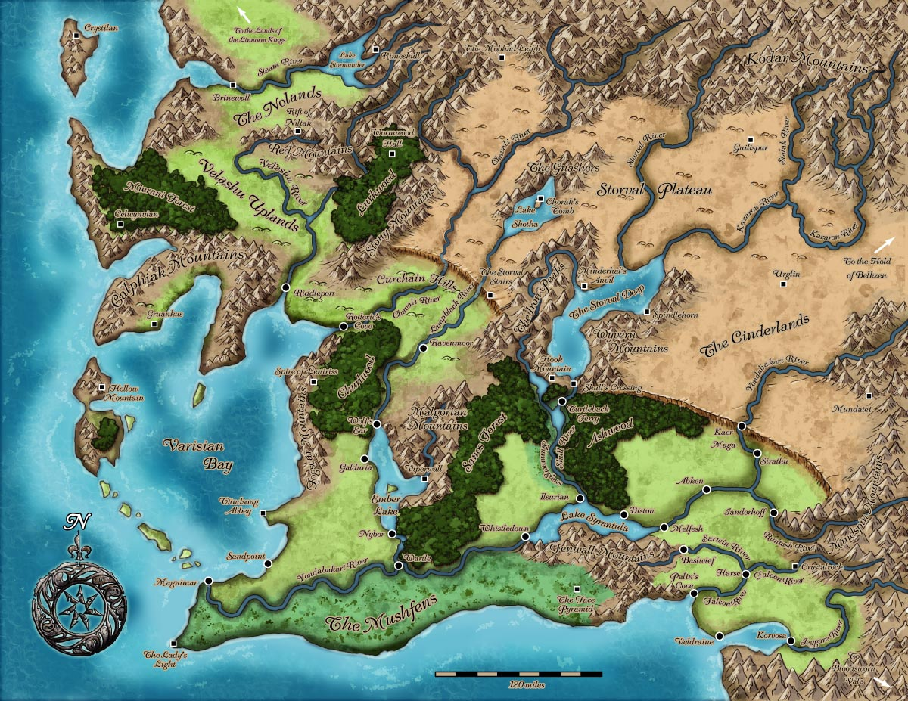
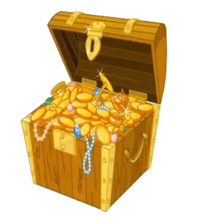

# SpryMap

## Introduction
This is fork of original [SpryMap](http://candrews.net/blog/2010/10/introducing-sprymap/) with IE fix. 
Demo can be seen here: [demo.spidersoft.com.au/SpryMap/index.html](https://demo.spidersoft.com.au/SpryMap/index.html)
 
## Usage

```JAVASCRIPT
var map = new SpryMap({
   // The ID of the element being transformed into a map
   id : "",
   // The width of the map (in px)
   width: 800,
   // The height of the map (in px)
   height: 800,
   // The X value of the starting map position
   startX: 0,
   // The Y value of the starting map position
   startY: 0,
   // Boolean true if the map should animate to a stop
   scrolling: true,
   // The time (in ms) that the above scrolling lasts
   scrollTime: 300,
   // Boolean true if the map disallows moving past its edges
   lockEdges: true,
   // The CSS class attached to the wrapping map div
   cssClass: "",
   // The cursor CSS style rule to apply when the mouse hovers the map
   hoverCursor: "auto",
   // The cursor CSS style rule to apply when the mouse is dragged on the map
   dragCursor: "[closed hand cursor]"
});
```

## FAQ

1. Did you have a way to insert some clickable area on the map?  I want to insert on two different city on your map the possibility for a user to click and open a link.
```HTML

<map name="Map" id="Map">
<area alt="" title="" href="#" shape="rect" coords="432,49,758,425" onclick="alert('Area1');" />
<area alt="" title="" href="#" shape="rect" coords="589,1586,772,1727" onclick="alert('Area2');" />
<area alt="" title="" href="#" shape="rect" coords="435,1259,681,1581" onclick="alert('Area3');" />
<area alt="" title="" href="#" shape="rect" coords="688,1585,780,911" onclick="alert('Area4');" />
</map>
```

2. The another way to insert clickable on the map(css position)
```HTML
<style>
   #worldMap>a {
      position:absolute;
      width:10px;
      height:10px;
   }
</style>
<div id="worldMap">
   

   <a href="javascript:void(0)" onclick="alert('clickable demo')" style="top:420px;left:550px;background-color: red;">

   </a>

   <a href="javascript:void(0)" onclick="alert('clickable img demo')" style="top:500px;left:320px;">
      
   </a>

</div>
```